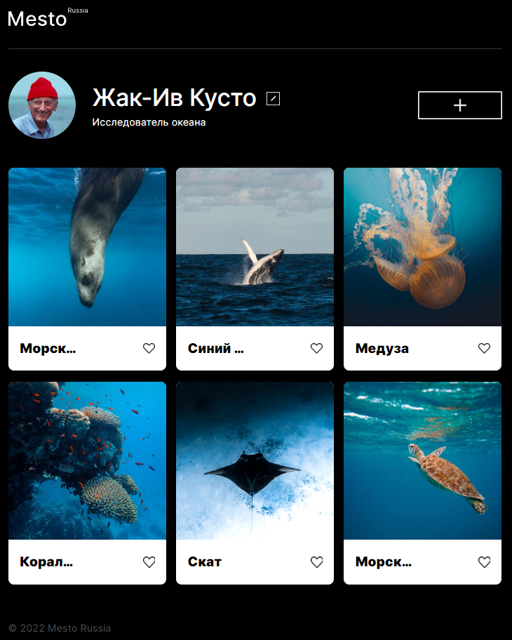

# «Mesto-react»

---

**Сервис «Mesto»** - это интерактивная страница, куда пользователь может добавлять фотографии, удалять их, а также ставить лайки.

---

Проект реализован с помощью **React Framework**.
Код написан в соответствии со стандартами Яндекс Практикума в рамках учебного проекта.

**Использованы технологии:**

- Методология БЭМ:
  - классы единиц описаны по БЭМ,
  - файловая структура БЭМ Nested;
- Flexbox и Grid;
- Медиазапросы для адаптивности сайта на разных устройствах;
- Простая анимация интерактивных элементов;
- ООП концепция;
- Проект портируется на React:
  - JSX,
  - хуки useState и useEffect;
  - компоненты и декларативный подход.

<!-- ##### [Ссылка на GitHub Pages](https://yanika90.github.io/mesto/) -->

---

**_В планах последующая доработка:_**

- _Дать возможность пользователям добавлять и удалять карточки;_
- _Создать счетчик лайков "like";_
- _Добавить возможность редактирования изображения профиля._
